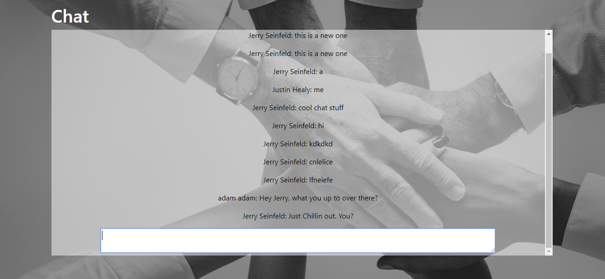

# Social-Network

This is a social Network built using React.js, Socket IO and Redux.

Within this app, users can:
- Publicly chat
- Search for other users database via an incremental search tab
- Friend each other
- Post on messages to their own wall
- View posts from other users
- Delete current friends, terminate pending requests and accept requests

